# FlowPitch

FlowPitch is a lightweight demo framework that enables users to create and share video pitches directly through WhatsApp in seconds. This is a prototype project, not intended for production use.

## Architecture



## Features

- Chatting with a bot on WhatsApp about your product
- Claude converts your requirements to video scripts 
- The remote server creates your video using the scripts with Remotion

## Installation

### WhatsApp setup
1. Go to https://developers.facebook.com and log in with your Facebook account.  
2. Click **My Apps** in the top-right corner.  
3. Click **Create App**.  
4. On the use-case page, select **Connect and interact with WhatsApp users**  
   (or **Connect with customers through WhatsApp** — the label may vary by region).  
5. Give your app a name (e.g. *Video Creator Bot*) and click **Next** through the remaining setup pages.  
6. Go to API Setup, get the following details
    - PHONE_NUMBER_ID: On the API Setup page, find the From phone number section. The numeric ID directly beneath the phone number is your PHONE_NUMBER_ID (looks like 123456789012345).
    - WHATSAPP_TOKEN (temporary — for testing)
    - APP_SECRET
7. Configure your Webhook. This step requires your Railway server to already be deployed.  
    - a) On the API Setup page click Configure webhooks (or go to the Webhooks section in the left sidebar).
    - b) Enter your Railway public URL followed by /webhook as the Callback URL: https://yourapp-production.up.railway.app/webhook
    - c) Enter the VERIFY_TOKEN value you chose (the same string you put in Railway’s environment variables).
    - d) Click Verify and Save. Meta will call your server with a GET request; your server will echo back the challenge and verification will succeed.
    - e) After verification, find the Webhook fields table and click Subscribe next to messages.
    


> **Note:** You do not need a Business Portfolio at this stage. The app will be created in development mode, which is sufficient for testing.

### Cloud server - Railway
``` 
    1. Push server.js and package.json on Git
    1. Go to railway.app → New Project → Deploy from GitHub
    2. Add these environment variables in Railway's settings panel:
        VERIFY_TOKEN — any string you choose 
        WHATSAPP_TOKEN — your Meta permanent access token
        APP_SECRET — from your Meta app's Basic Settings
        PHONE_NUMBER_ID — from the WhatsApp API setup page in Meta
    3. Railway gives you a public URL like https://yourapp.railway.app
    4. Paste https://yourapp.railway.app/webhook into the Meta dashboard as your webhook URL, enter your VERIFY_TOKEN, and subscribe to the messages field
```


## Usage

```bash
# Usage examples
```

## Requirements

- Node.js 16+

## Contributing

Contributions welcome. Please open an issue or PR.

## License

MIT